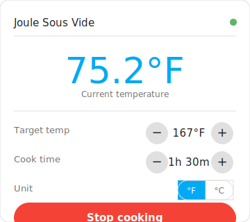

# ChefSteps Joule Sous Vide — Home Assistant Integration

Control and monitor your **ChefSteps Joule** circulator directly from Home Assistant, without the ChefSteps app.



> **Status: v0.18.6 — Hardware-validated.** The integration communicates with the Joule over BLE using [redacted] protobuf messages, with application-level key exchange authentication and real-time temperature streaming. See [Known Limitations](#known-limitations) and the [Development History](#development-history) appendix.

---

## What You Get

Once set up, Home Assistant creates five entities for your Joule, all under a single **ChefSteps Joule Sous Vide** device:

| Entity | Type | What it does |
|---|---|---|
| **Current Temperature** | Sensor | Live water temperature in °C, updated every 30 seconds |
| **Sous Vide** | Switch | Starts and stops the cooking cycle |
| **Target Temperature** | Number | Temperature to heat to (displayed in °F or °C, default °F) |
| **Cook Time** | Number | How long to cook in minutes (0 = no time limit) |
| **Temperature Unit** | Select | Choose °F or °C for the Target Temperature display (persisted across restarts) |

---

## Requirements

- Home Assistant **2024.2** or newer
- Your HA host within **~10 metres** of the Joule (Bluetooth range)
- The Joule **powered on** and not connected to the ChefSteps app
- The Joule's **Bluetooth MAC address** (see [Finding Your MAC Address](#finding-your-mac-address))

---

## Installation

### Method 1 — HACS (recommended)

[HACS](https://hacs.xyz) is the Home Assistant Community Store. It handles installation and updates automatically.

1. Make sure [HACS is installed](https://hacs.xyz/docs/use/).
2. In Home Assistant, go to **HACS** → **Integrations**.
3. Click **⋮** → **Custom repositories**, add `https://github.com/acato/ha-joule`, category **Integration**.
4. Search for **ChefSteps Joule Sous Vide** and click **Download**.
5. **Restart Home Assistant.**

> The custom Lovelace card is bundled with the integration and registers itself automatically — no separate Frontend download needed. See [How To: Use the Custom Lovelace Card](docs/how-to-lovelace-card.md) for setup instructions.

### Method 2 — Manual

1. Copy the `custom_components/joule_sous_vide/` folder into the `custom_components/` directory inside your HA configuration directory.
2. **Restart Home Assistant.**

> The Lovelace card is bundled and registers itself automatically on startup.

### Add the integration

1. Go to **Settings** → **Devices & Services** → **+ Add Integration**.
2. Search for **Joule** and select **ChefSteps Joule Sous Vide**.
3. Enter your Joule's Bluetooth MAC address (`AA:BB:CC:DD:EE:FF`) and click **Submit**.
4. **First-time only:** A notification will appear asking you to press the physical button on top of the Joule within 60 seconds. This completes the application-level key exchange. The key is saved automatically — subsequent connections won't require the button press.

> ✅ On success, a **"Joule AA:BB:CC:DD:EE:FF"** device appears with five entities ready to use.
>
> **Tip:** If you have a valid auth key from the official app, you can import it via **Settings > Devices > Joule > Configure** to skip the button press.

---

## Finding Your MAC Address

**Easiest — phone app:**
1. Install a free Bluetooth scanner (iOS/Android: "nRF Connect" or "BLE Scanner").
2. Power on your Joule and open the app.
3. Scan for devices and look for one named **"Joule"**.
4. The address shown (e.g. `D4:9A:20:01:F3:8B`) is what you need.

**Linux / Raspberry Pi host:**
```bash
bluetoothctl scan on
# Wait a few seconds, find the entry named "Joule", press Ctrl+C to stop
```

---

## Using the Integration

**Set your temperature:** Adjust the **Target Temperature** number entity to your desired setpoint before starting. Use the **Temperature Unit** selector to choose °F or °C — your preference is saved across restarts.

**Set cook time:** Set the **Cook Time** number entity (in minutes). Leave it at 0 for no time limit.

**Start a cooking session:** Toggle the **Sous Vide** switch on. The Joule reads the current Target Temperature and Cook Time values and begins heating.

**Stop cooking:** Toggle the switch off. The Joule stops immediately.

**Monitor temperature:** The **Current Temperature** sensor updates every 30 seconds and works in dashboards, automations, and templates.

**Automate:** Use standard HA automations to schedule cooks, send alerts when the target temperature is reached, or control the Joule with a voice assistant.

```yaml
# Example: notify when the bath is up to temperature
trigger:
  - platform: numeric_state
    entity_id: sensor.joule_current_temperature
    above: 59.5
action:
  - service: notify.mobile_app
    data:
      message: "Water bath is ready!"
```

---

## Known Limitations

| Limitation | Details |
|---|---|
| **BLE-only — no cloud** | The ChefSteps cloud is shutting down (March 2026). This integration communicates exclusively over Bluetooth. WiFi/cloud control is not supported. |
| **First-time auth requires button press** | The Joule uses application-level key exchange, not OS-level BLE pairing. On first setup, the user must press the physical button on the Joule within 60 seconds. The key is persisted and reused automatically on reconnection. Alternatively, import a key via **Settings > Devices > Joule > Configure**. |
| **BLE protocol** | The protobuf message format is [redacted] from [[redacted]](https://github.com/[redacted]/[redacted]) and iOS PacketLogger captures. Commands may not work on all firmware versions. |
| **State polling delay** | Cooking state is read from the device every 30 seconds via `program_step`. Between polls, state may be stale if the Joule is controlled from the ChefSteps app. |
| **One connection at a time** | Bluetooth only supports one active connection. Close the ChefSteps app before using this integration. |
| **ESPHome proxy support** | ESPHome Bluetooth Proxies are supported but local adapters are preferred. When connected via proxy, the integration polls for data instead of relying on notifications. |

---

## Troubleshooting

**Entities show "Unavailable":** The Joule is out of Bluetooth range, powered off, or another app has the connection. The integration reconnects automatically once the device is available again.

**"Failed to connect" during setup:** Check the Joule is powered on, within range, and not connected to the ChefSteps app. Double-check the MAC address format (`AA:BB:CC:DD:EE:FF` with colons, uppercase).

**Integration not appearing in the search:** Make sure the folder is named exactly `joule_sous_vide`, is inside the `custom_components/` directory, and Home Assistant was restarted after copying it.

For full troubleshooting steps, see **[docs/troubleshooting.md](docs/troubleshooting.md)**.

---

## Documentation

- [Getting Started](docs/getting-started.md)
- [How To: Start a Cooking Session](docs/how-to-start-cooking.md)
- [How To: Monitor Temperature](docs/how-to-monitor-temperature.md)
- [How To: Automate Your Joule](docs/how-to-automate.md)
- [How To: Use the Custom Lovelace Card](docs/how-to-lovelace-card.md)
- [Entity Reference](docs/reference-entities.md)
- [Troubleshooting](docs/troubleshooting.md)
- [Advanced: Finding BLE UUIDs with nRF Connect](docs/how-to-find-uuids.md)

---

## Development History

This integration was built iteratively over 30+ releases and 70+ commits, [redacted] the Joule's BLE protocol from scratch. The journey included migrating BLE stacks, discovering an application-level key exchange, debugging MTU and protobuf encoding issues, and capturing the official iOS app's traffic with Apple's PacketLogger to find the final missing pieces.

For the full story, see:

- **[[redacted] Journal](docs/[redacted]-journal.md)** — detailed chapter-by-chapter account of every BLE theory tested and ruled out
- **[Blog Post: Two Bytes That Bricked My Sous Vide](docs/blog-post.md)** — narrative write-up of the debugging journey

---

## Contributing

Issues and pull requests are welcome at [github.com/acato/ha-joule](https://github.com/acato/ha-joule).

When reporting a bug, please include your Home Assistant version and the relevant log lines from `joule_sous_vide` (Settings → System → Logs).

---

## Disclaimer

**Joule** and **ChefSteps** are trademarks of Breville Group Limited. **Home Assistant** is a trademark of the Open Home Foundation. This project is not affiliated with, endorsed by, or sponsored by Breville, ChefSteps, or the Open Home Foundation. All trademarks belong to their respective owners.
